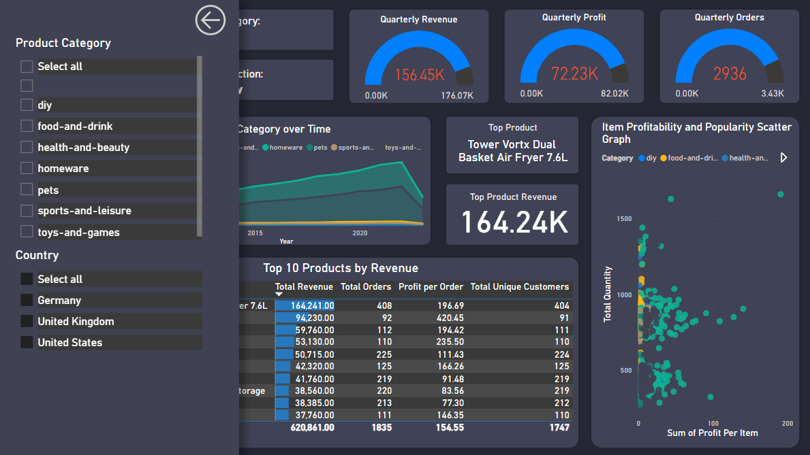
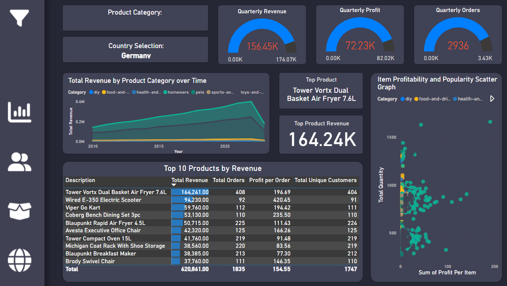
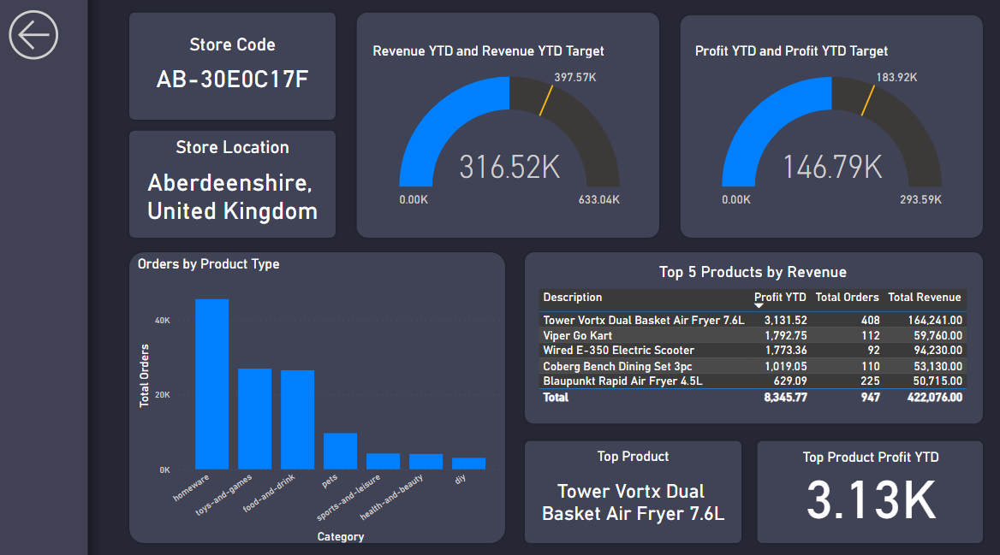

# Data Analytics Power BI Report
By **Joel Sud**
## Table of Contents:
- [Description](#description)
- [Installation Instructions](#installation_instructions)
- [Usage Instructions](#usage_instructions)
- [File Structure](#file_structure)
    - [File Description](#understanding-the-files)
- [Project Documentation:](#project-documentation)
    - [Milestone 2](#milestone-2)
    - [Milestone 3](#milestone-3)
    - [Milestone 5](#milestone-5)
    - [Milestone 6](#milestone-6)
    - [Milestone 7](#milestone-7)
    - [Milestone 8](#milestone-8)

## Description: 
This is an Ai Core project with the aim of conducting data analysis on a Orders database in Power BI.

## Installation Instructions:
1. **Download and clone repository:**
- copy the repository URL by clicking '*<> Code*' above the list of files in GitHub Repo. Then copy and paste the '*HTTPS*' URL:
- in your CLI go to the location where you wish to clone your directory.
- Type the following '***git clone***' command with the '*HTTPS*' URL:

***
git clone https://github.com/joelsud18/data-analytics-power-bi-report202.git***

- Press 'Enter'.

## Usage Instructions

## File Structure:
- data_analytics_report.pbix
- subsidiary_material
    - data_model.png
    - customer_detail.png
    - executive_summary.png
    - product_detail.png
    - stores_map.png
    - drill_through_page.png
    - theme.json
    - navigation_bar_images

### Understanding the Files:
- **data_analytics_report.pbix**: This is the Power BI file which contains the data models, queries and report with visuals.
- **subsidiary_material**: This is a folder that contains subsidiary material such as .png screenshots of the data model or report.
- **theme.json**: This contains the power bi report theme used.

## Project Documentation

This section shows documentation of the steps and tasks undertaken to complete key milestones. Insignificant milestones that contained minimal or insiginficant tasks were excluded.

### Milestone 2:
- Once the .pbix file was created, the first step was to import the 'Orders' fact table. This was imported from an Azure SQL database.
    - Confidential columns were deleted; Date columns were split between date and time and rows with missing values were removed.
- The following dimension tables were also imported into the model:
    - 'Product' table was imported from a .csv file.
        - Units were converted to kg.
    - 'Stores' table was imported from Azure Blob Storage.
    - 'Customers' table was improted by combining and transforming 3 .csv files following the same schema in a zip file.
- It was ensured that column names in all tables followed Power BI naming conventions.

### Milestone 3:
- To use Power BI's time intelligence functionality a continuous dates table was created. This was created for the period over 2010 to 2023 and included the dates, weekday, month name and number, quarter, year, start of year, start of quarter, start of month and start of week.

    To create the dates table, the following DAX formulas was used:

    ***
Dates = DATESBETWEEN(
    Orders[Order Date], 
    MIN(Orders[Order Date]), 
    DATE(2023,12,31)
    )***
   

    To create different calculated columns, here are some examples of the DAX formulas used:

    ***
Day of Week = FORMAT(DATES[Date],"dddd")***

    ***
Quarter = QUARTER(Dates[Date])***

    ***
Start of Week = Dates[Date] - WEEKDAY(Dates[Date],2) + 1***

- Within this dates table a hierarchy was created from start of year down to the date.
- Following this the star schema was created, for this the relevant columns in the dimension tables were dragged to the relevant column in the fact table, this was done so that there would be a one-to-many relationship which allows for data to be filtered effectively. The columns that were related is shown below:
    - Products[Product Code] to Orders[Product Code]
    - Stores[store code] to Orders[Store Code]
    - Customers[User UUID] to Orders[User ID]
    - Dates[Date] to Orders[Order Date]
    - Dates[Date] to Orders[Shipping Date]

    These relationships are visible in the data model schema, shown in the image at the end of this milestone.
- A measures table was then generated to store key measures, these included:
    - Total Orders
    - Total Revenue
    - Total Profit
    - Total Customers
    - Total Quantity
    - Profit YTD
    - Revenue YTD

    These were generated using DAX formulas, some of which can be seen below:

    ***
Total Orders = COUNT(Orders[Order Date])***

    ***
Total Revenue = SUMX(Orders, Orders[Product Quantity] * RELATED(Products[Sale Price]))***

    ***
Profit YTD = 
CALCULATE(
    [Total Profit],
    DATESYTD(Dates[Date])
)***

- After this, the following DAX expression was used to create the Country column in the Stores table:

    ***
Country = 
    SWITCH (
        [Country Code],
        "GB", "United Kingdom",
        "US", "United States",
        "DE", "Germany", 
        BLANK()
    )***

    Following this a Geography column was created to represent both the country and region in the country together using the following DAX formula:

    ***
Geography = Stores[Country Region] & ", " & Stores[Country]***

- Finally a Geography hierarchy was created with Region (continent) coming first, followed by Country, followed by the Country Region.

Below is a screenshot of the data model after this stage:

### Milestone 5:
- This milestone was focused on the customer detail page of the report. To start with, a Total Customers (Unique Customers) and Total Revenue Per Customer card was added as headline cards to the page.
- Following this two summary charts were added:
    - Donut chart - total customers for each country, using the Users[Country] column to filter the [Total Customers] measure.
    - Column chart - number of customers who purchased each product category, using the Products[Category] column to filter the [Total Customers] measure.
- After this, a Line Chart visual with [Total Customers] on the Y axis and  the Date Hierarchy on the X axis allowing users to drill down to the month level, but not to weeks or individual dates.
    - To this a trend line was added, and a forecast for the next 10 periods with a 95% confidence interval.
- In the next step a new table with data bars was created to display the top 20 customers, filtered by revenue. The table shows each customer's full name, revenue, and number of orders.
- Next a set of three card visuals that provide insights into the top customer by revenue were added. These displayed the top customer's name, the number of orders made by the customer, and the total revenue generated by the customer.

    To create these cards the following measures were created:

    ***
Customer with Most Revenue = TOPN(1, VALUES('Customers'[Full Name]), [Total Revenue], DESC)***

    ***
Number of Orders by Top Customer = 
CALCULATE(
    COUNTROWS('Orders'),
    TOPN(1, VALUES('Customers'[User UUID]), [Total Revenue], DESC)
)***

    ***
Total Revenue by Top Customer = 
CALCULATE(
    [Total Revenue], 
    TOPN(1, VALUES('Customers'[User UUID]), [Total Revenue], DESC)
)***

- Finally a date slicer was added to allow users to filter the page by year, using the between slicer style.

The following image shows the customer detail page at this point:

### Milestone 6:

- This milestone focused on developing the executive summary page. This started off with generating the summary cards. Three cards were inputted which displayed the total revenue, total profit and total orders measures.
- Following this a line chart was added, this used the date hierarchy from start of year down to start of month, however the y-axis displayed total revenue.
- Two donut charts were then added, both displayed the total revenue however one was filtered by country and the other by store type in the legend.
- After this, a clustered bar chart was added, this used product category in the y-axis and total orders in the x-axis.
- Finally the KPI cards were added, these were done for total revenue, total profit and total orders in the current quarter.
    - to generate this first new measures were made, this was previous quarter revenue, profit and orders. the following DAX formula shows how this was created for the example of previous quarter profit:

    ***
Previous Quarter Profit = CALCULATE(
    SUMX(Orders, (RELATED(Products[Sale Price]) - RELATED(Products[Cost Price])) * ORDERS[Product Quantity]),
    PREVIOUSQUARTER(Dates[Date])
)***

    - This was followed by generating a target revenue, profit and orders for the current quarter which would be a 5 % increase from the previous quarter. The following is an example of the DAX code for the target profit as an example:

    ***
Target Profit = 'Measures Table'[Previous Quarter Profit] * 1.05***

    - This was followed by creating the KPI visual with in the case of profit, the total profit as the value, the start of quarter as the trend axis and the target profit for the target. This was also done for revenue and orders.

The following image shows the executive summary page at this point:

### Milestone 7:

- This milestone looked at the product detail page, to start with three gauges were created. For these the current quarterly revenue, profit and orders were tracked against 10 % quarter on quarter targets.

    - To create the current quarter measures, the following DAX formula was used for the example of revenue:

    ***
Current Quarter Revenue = TOTALQTD(SUMX(Orders, Orders[Product Quantity] * RELATED(Products[Sale Price])), Dates[Date])***

    - Following this the previous quarter measures were calculates which can be seen below for the previous quarter revenue:

    ***
Previous Quarter Revenue = 
VAR CurrentQuarterStart = MAX(Dates[Start of Quarter])
VAR PreviousQuarterStart = EDATE(CurrentQuarterStart, -3)
VAR PreviousQuarterEnd = EDATE(CurrentQuarterStart, -1)
RETURN
CALCULATE([Total Revenue], Dates[Start of Quarter] = PreviousQuarterStart)***

    - Finally to create the target, for the example of revenue, the following DAX formula was used:

    ***
Revenue Quarterly Target = 'Measures Table'[Previous Quarter Revenue] * 1.1***

    - This was repeated for profit and total orders to create the gauges.
- Following this an areas chart with the x-axis set as Dates[Start of Quarter], the y-axis values set as Total Revenue
and the Legend as Products[Category] was created.
- Following this a table wss created displaying the top 10 product descriptions by revenue (where data bars were added), showing their total orders, profit per order and total customers.
- Two cards were added to highlight the top product, one card gives the product description, the other its revenue. To get these values the following DAX expressions were used:

    ***
Top Product = 
TOPN(
   1,
   VALUES(Products[Description]),
   [Total Revenue], DESC
)***

    ***
Total Revenue by Top Product = 
CALCULATE(
    [Total Revenue], 
    TOPN(1, VALUES(Products[Description]), [Total Revenue], DESC)
)***

- After this a scatter graph was added to compare item profitaility with the total quantity ordered. 
    - The first step was adding a profit per item column to the products table using the following formula:

    ***
Profit Per Item = Products[Sale Price] - Products[Cost Price]***

    - The next step involved setting the values as the product descriptions, the x-axis as the profit per item, the y-axis as the total orders and the legend as product category.
- The next step was to add a slicer panel, to do this two buttons were created; the slicer button which was given a tool tip and action to open a bookmark where the slicer panel was open; and a 'back' button on the panel itslef, which was given a tool tip and action to open a book mark where the slicer panel was not visible. in the slicer panel there were two vertical list slicers, one to filter the page by country and one by product category. This can be seen below:

    

The following image shows the product detail page at this point:

### Milestone 8:

- The first stage involved adding the map visual to the stores map page. For this the geography hierarchy was assigned to the location and profit YTD to the bubble size.
- Next a multi-select tile slicer was included to select between country.
- Following this a drill through page was made for each individual store. This displays:
    - the store name and location on cards.
    - a gauge which includes the current profit YTD and revenue YTD. The targets are set to 20 % year-on-year increase from previous year YTD values. The following dax formula was used to create the target for the example of profit YTD:

    ***
Profit YTD Target = 
CALCULATE(
    [Total Profit],
    SAMEPERIODLASTYEAR(DATESYTD(Dates[Date]))
) * 1.2***

    - a column chart shows the orders by product type.
    - a table shows the top 5 products and their profit YTD, number of orders and total revenue.
    - underneath the table are two cards showing that stores top pproduct and its profit YTD.
    
    This drill through page can be seen below:

    

- Finally a tooltip page was created with the profit YTD guage which will be used as a tool tip for each store.

The following image shows the stores map page at this point:

